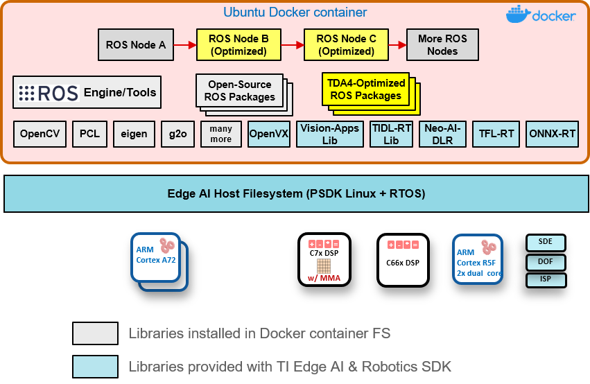
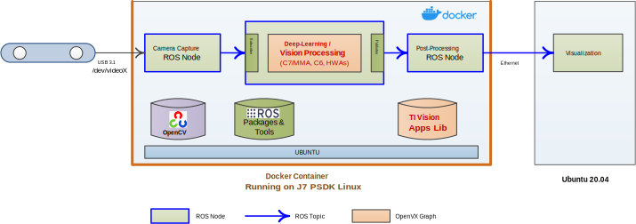
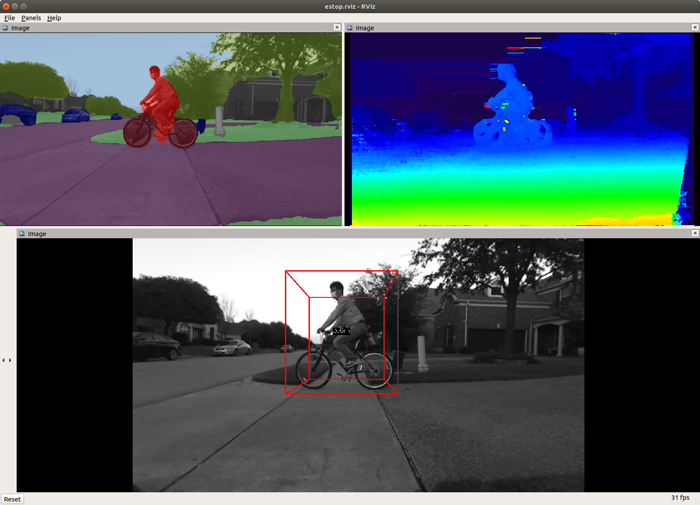

# Robotics SDK

## Robotics SDK User Guide

| Platform   | Link to Documentation                                                                                         |
| ---------- | ------------------------------------------------------------------------------------------------------------- |
| **AM62A**  | [Robotics SDK for AM62A](https://software-dl.ti.com/jacinto7/esd/robotics-sdk/10_01_00/AM62A/docs/index.html)   |
| **TDA4VM** | [Robotics SDK for TDA4VM](https://software-dl.ti.com/jacinto7/esd/robotics-sdk/10_01_00/TDA4VM/docs/index.html) |
| **AM67A**  | [Robotics SDK for AM67A](https://software-dl.ti.com/jacinto7/esd/robotics-sdk/10_01_00/AM67A/docs/index.html)   |
| **AM68A**  | [Robotics SDK for AM68A](https://software-dl.ti.com/jacinto7/esd/robotics-sdk/10_01_00/AM68A/docs/index.html)   |
| **AM69A**  | [Robotics SDK for AM69A](https://software-dl.ti.com/jacinto7/esd/robotics-sdk/10_01_00/AM69A/docs/index.html)   |

## Robotics SDK: Introduction

The Robotics SDK provides a ROS-based robotics software development environment for Texas Instruments Edge AI Processors, including AM62A, TDA4VM, AM67A, AM68A, and AM69A. It offers software building blocks and example demos that can be leveraged in robotics software development. The SDK operates in Docker container environments on the Processor SDK Linux:

- [Processor SDK Linux for AM62A](https://www.ti.com/tool/download/PROCESSOR-SDK-LINUX-AM62A)
- [Processor SDK Linux for TDA4VM](https://www.ti.com/tool/download/PROCESSOR-SDK-LINUX-SK-TDA4VM)
- [Processor SDK Linux for AM67A](https://www.ti.com/tool/download/PROCESSOR-SDK-LINUX-AM67A)
- [Processor SDK Linux for AM68A](https://www.ti.com/tool/download/PROCESSOR-SDK-LINUX-AM68A)
- [Processor SDK Linux for AM69A](https://www.ti.com/tool/download/PROCESSOR-SDK-LINUX-AM69A)

The Robotics SDK enables:

- Optimized implementation of computation-intensive software building blocks (including deep-learning, vision, perception, mapping and localization) on deep-learning core (C7x/MMA), DSP cores, hardware accelerators integrated into the processors.
- Application software development on the target using libraries optimized on the TI Processor, along with many open-source libraries and packages including, for example, OpenCV, Point-Cloud Library (PCL), and more.

### Robotics SDK: Software Stack

 <figcaption>Figure 1. Robotics SDK: Software Stack (Note: hardware diagram varies depending on the platform.) </figcaption>

### Support for Open-Source Deep-Learning Runtime

The Processor SDK Linux for Edge AI also supports the following open-source deep-learning runtime libraries:

- TVM/Neo-AI-DLR
- TFLite Runtime
- ONNX Runtime

Figure 2 shows a representative deep-learning and compute-intensive demo application developed with the Robotics SDK.

<figcaption>Figure 2. Example Demo Application with Robotics SDK </figcaption>
 

## Sensor Driver Nodes

The following ROS nodes for cameras and radar sensors are supported by the SDK:

- [USB Stereo Camera Capture Node for ZED Cameras](ros2/drivers/zed_capture/README.md)
- [GStreamer-based Camera Capture Node](ros2/drivers/gscam2/README_TI.md)
- [USB Mono Camera Capture Node](ros2/drivers/mono_capture/README.md)
- [mmWave Radar Driver Node](docs/radar_driver_node_ros2.md)

## Demo Applications

The SDK supports the following out-of-box demo applications:

- [Stereo Vision Processing Accelerated on LDC and SDE](ros2/nodes/ti_sde/README.md)
- [Semantic Segmentation CNN Accelerated on C7x/MMA](ros2/nodes/ti_vision_cnn/README.md)
- [Object Detection CNN Accelerated on C7x/MMA](ros2/nodes/ti_vision_cnn/README_objdet.md)
- [6D Pose Estimation CNN Accelerated on C7x/MMA](ros2/nodes/ti_vision_cnn/README_6D_pose.md)
- [Human Pose Estimation CNN Accelerated on C7x/MMA](ros2/nodes/ti_vision_cnn/README_humanpose.md)
- [3D Obstacle Detection Accelerated on SDE and C7x/MMA](ros2/nodes/ti_estop/README.md)
- [Vision Object Detection with 3D Spatial Information](ros2/nodes/ti_objdet_range/README.md)
- [Camera + Radar Fusion Accelerated on C7x/MMA](ros2/nodes/ti_objdet_radar/README.md)
- [Visual Localization Accelerated on C7x/MMA](ros2/nodes/ti_vl/README.md) (for TDA4VM, AM68A, and AM69A only)

<figcaption>Figure 3. Demo Application Examples </figcaption>
 

## Change Log

See [CHANGELOG.md](CHANGELOG.md) for the change log.

## Questions & Feedback

If you have any questions or feedback, please visit [TI E2E](https://e2e.ti.com/support/processors).
