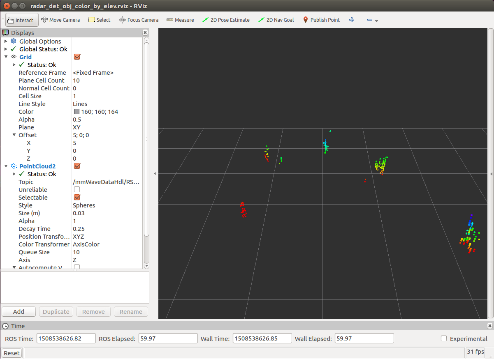

mmWave Radar ROS Node
========================


<br />


This is a radar ROS node for TI's mmWave devices. The ROS node sets up a ROS service as an interface to configure the mmWave Evaluation Module and publishes a ROS PointCloud2 message with the objects detected when the sensor is activated.

```{note}
This ROS node, running on SK-AM62A, SK-TDA4VM, SK-AM68A and SK-AM69A, currently is tested only with TI's [IWR6843ISK](https://www.ti.com/tool/IWR6843ISK).

In the following, we provide a summary of instruction for setting up and running the radar ROS node. For details, please refer to [TI mmWave ROS Driver Users Guide](https://dev.ti.com/tirex/explore/node?node=A__AFIEVaaBoBCgo.VCtJenZQ__radar_toolbox__1AslXXD__LATEST)
```

## Setup

### Re-flash the the TI mmWave EVM with Out-of-Box firmware

If you are using a brand new TI mmWave EVM, it may come pre-flashed with an older version of the Out-of-Box Demo. The EVM should be re-flashed with the Out-of-Box demo from the compatible version of the mmWave SDK.

1. On a PC, download Uniflash, via following the following link: [https://www.ti.com/tool/UNIFLASH](https://www.ti.com/tool/UNIFLASH)


2. Make sure the file `/lib/x86_64-linux-gnu/libudev.so.0` exists. If it does not exist execute the following command to generate a symbolic link necessary for Uniflash to work:
    ```sh
    sudo ln -sf /lib/x86_64-linux-gnu/libudev.so.1 /lib/x86_64-linux-gnu/libudev.so.0
    ```

3. Navigate to the download directory, make the file executable and run the Uniflash installer:
    ```sh
    cd ~/Downloads
    ```
    ```
    chmod +x niflash_sl.4.2.1.1562.run
    ```
    ```sh
    ./uniflash_sl.4.2.1.1562.run
    ```

4. Download the linux version of the [mmWave SDK](https://www.ti.com/tool/mmwave-sdk). MmWave SDK version:
    - Compatible with TI mmWave SDK v3.6 out-of-box demo when using IWR6843AOPEVM
    - Compatible with TI mmWave SDK v3.6 out-of-box demo when using IWR6843 ES2.0 EVM

5. Install the following mmWave SDK dependency:
    ```sh
    sudo apt-get install libc6:i386
    ```

6. Navigate to the download directory, make the file executable and run the mmWave SDK installer (change `<ver>` to the appropriate version):
    ```sh
    cd ~/Downloads
    chmod +x mmwave_sdk_<ver>-Linux-x86-Install.bin
    ./mmwave_sdk_<ver>-Linux-x86-Install.bin
    ```

7. Follow the [EVM Operational Modes Setup Guide](https://dev.ti.com/tirex/explore/node?node=A__ACzleIuZ4g1GuBmtlq-cGg__com.ti.mmwave_industrial_toolbox__VLyFKFf__LATEST) to configure the device for `flashing` mode. Once configured for flashing mode, power cycle the device by toggling the NRST switch or unplugging then reconnecting the micro usb cable.

8. Follow the [Using Uniflash with mmWave Guide](https://dev.ti.com/tirex/explore/node?node=AGuT13c2cuwxqZKfpyurBQ__VLyFKFf__LATEST) to flash the device with the appropriate binary.

    Ensure the device is connected to the PC, then serial port names can be found with:
    ```sh
    ls /dev | grep 'ttyUSB'  # for standalone EVMs
    ls /dev | grep 'ttyACM'  # for EVM + ICBOOST carrier board
    ```

    Two serial ports should appear e.g.: `ttyUSB0` and `ttyUSB1`, in this example, `/dev/ttyUSB0` should be entered as the COM port in the `Settings & Utilities` tab in Uniflash.

    The .bin file can be found at `<MMWAVE_SDK_INSTALL_DIR>/packages/ti/demo/xwr68xx/mmw/xwr68xx_mmw_demo.bin`.


9. Follow the [EVM Operational Modes Setup Guide](https://dev.ti.com/tirex/explore/node?node=AMLjV2I4hAEEwpYRfP2okA__VLyFKFf__LATEST) to configure the device for `functional` mode. Once configured for functional mode, power cycle the device by toggling the NRST switch or unplugging then reconnecting the micro usb cable.

### Select Chirp Configuration

This ROS node will, by default, use a chirp configuration that optimizes range resolution. The configuration file is located under `ti_mmwave_rospkg/cfg` folder.
If you wish to use the default chirp configuration, no further action is required.

If you wish to use a custom chirp configuration, the [mmWave Sensing Estimator](https://dev.ti.com/gallery/view/mmwave/mmWaveSensingEstimator/ver/2.3.0/) can be used to estimate the chirp configuration based on scene parameters. For more information on how to select the right chirp parameters in a FMCW Radar device, please see [Programming Chirp Parameters in TI Radar Devices](https://www.ti.com/lit/an/swra553a/swra553a.pdf).

## Build and Launch the Radar ROS Node

1. Build the mmWave radar ROS node in the SDK Docker container on the SK board
    ```sh
    cd $ROS_WS
    colcon build --base-paths /opt/robotics_sdk/ros2 --packages-select ti_mmwave_rospkg
    source install/setup.bash
    ```

2. Launch the mmWave radar ROS node
    ```sh
    ros2 launch ti_mmwave_rospkg 6843ISK_Standard.py rviz:=false
    ```

## Visualization on Remote Ubuntu PC

In the PC Docker container,
```sh
ros2 launch ti_mmwave_rospkg rviz_launch.py
```
