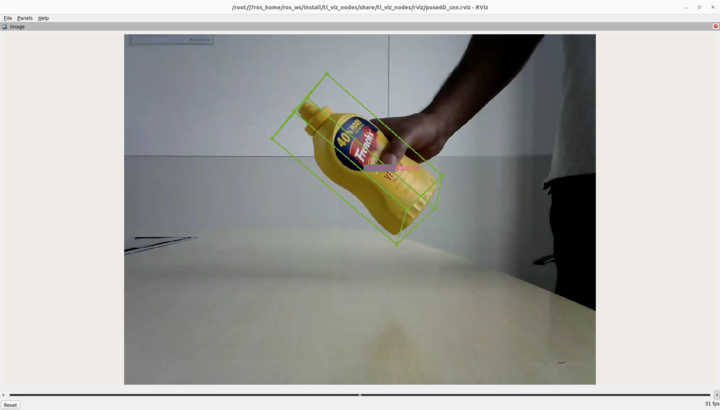

6D Pose Estimation
================


<br />

This `ti_vision_cnn` node is a versatile deep-learning (DL) inference ROS node that is optimized on DL cores and hardware accelerator of TI Processors. The `ti_vision_cnn` node supports compute-intensive DL inference operations, including 2D object detection, 6D Pose Estimation and semantic segmentation. Figure 1 shows the high-level block diagram of the applications around the `ti_vision_cnn` node, which consists of multiple processing blocks that are deployed on hardware accelerators and DSP processors for pre-processing and post-processing in an optimized manner.

## System Description


<figcaption>Figure 1. 6D Pose demo: block diagram</figcaption>
<br />

For details of block diagram and parameters of `ti_vision_cnn`, please refer to [README.md](./README.md).

For details about the model for 6D pose estimation, please refer to [YOLO-6D-Pose Multi-Object 6D Pose Estimation Model](https://github.com/TexasInstruments/edgeai-yolox/blob/main/README_6d_pose.md).

```{note}
**cam_id** and **subdev_id** for cameras: You can check the cam_id and subdev_id for the camera
attached to the SK board by running `/opt/edgeai-gst-apps/scripts/setup_cameras.sh` on the target
host Linux. Accordingly please update the parameters or pass as launch arguments.
```

## Run the Application in ROS 2

**[SK]** To launch the 6D pose estimation demo with playing back a ROSBAG file, run the following command inside the Docker container on the the target SK board:
```
ros2 launch ti_vision_cnn bag_pose6D_cnn_launch.py
```

To process the image stream from a USB mono camera, depending on choice of resolution, run one from the following commands:
```
ros2 launch ti_vision_cnn gscam_pose6D_cnn_launch.py cam_id:=x width:=1280 height:=720
```

**[Visualization on Ubuntu PC]** For setting up environment of the remote PC, please follow [Docker Setup for ROS 2](../../../docker/setting_docker_ros2.md)

Depending on the resolution setting of the ROSBAG file, run the following command inside the Docker container on Ubuntu PC:
```
ros2 launch ti_viz_nodes rviz_pose6D_cnn_launch.py width:=1280 height:=960
```

Depending on the resolution setting of the capture node, run one from the following:
```
ros2 launch ti_viz_nodes rviz_pose6D_cnn_launch.py width:=1280 height:=720
```

## Known Issues

1. The default 6D pose estimation model is trained on a limited number of objects from the YCB dataset, with the mustard bottle being the sole object currently used for training. As a result, the accuracy of the model may be limited when it is used with different objects, with a different camera model, or in different scenarios.
