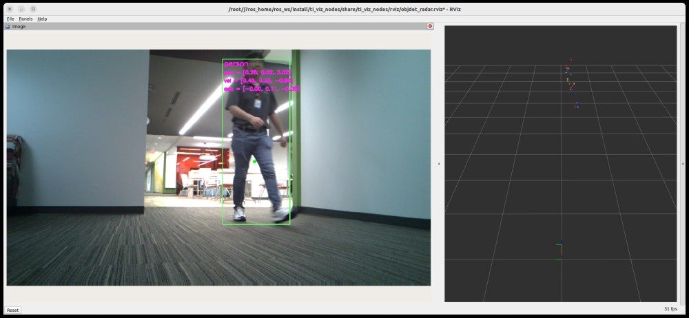
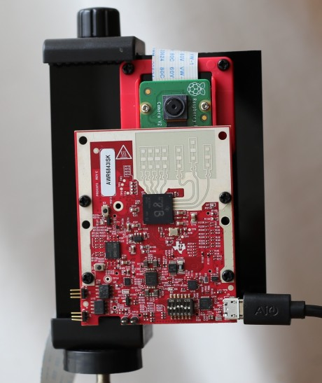

Camera + Radar Fusion
=====================


<br />

## System Description

### Sensor Module


<figcaption>Figure 1. Camera and radar sensor module built with IMX219 and IWR6843ISK</figcaption>
<br />

The camera and radar fusion demo application utilizes a camera and radar sensor module, which comprises an IMX219 CSI camera and an IWR6843ISK mmWave radar sensor. These two sensors are affixed to a rigid body, as depicted in Figure 1.

**mmWave Radar Firmware for IWR6843**: The prebuilt firmware is located at `ros2/drivers/ti_mmwave_rospkg/bin/3D_people_count_68xx_demo.bin`. For instructions on how to re-flash the TI mmWave EVM, please refer to the section titled “Re-flash the TI mmWave EVM” in [this documentation](../../../docs/radar_driver_node_ros2.md).

The mmWave radar firmware is primarily designed for people tracking applications. It includes radar processing with static clutter removal, high-resolution angular estimation, and features for object clustering and tracking.

### Block Diagram


<figcaption>Figure 2. Camera and radar fusion: block diagram</figcaption>
<br />

The camera and radar fusion demo application implements an object-level fusion approach that includes camera vision processing chain (`gscam2` and `ti_vision_cnn`) and radar processing chain (radar processing firmware on IWR6843 and `ti_mmwave_rospkg`), and a fusion node (`ti_objdet_radar`).

Referring to the block diagram (Figure 2),

1. Vision Processing Chain:
    - The camera capture node (`gscam2`) has a GStreamer pipeline that include ISP (offloaded on VISS), resizing (offloaded on MSC) and color-conversion, and it publishes the raw images in NV12 format.
    - Vision CNN node (`ti_vision_cnn`) is configured for 2D object detection. For more details, please see [Object Detection section](../ti_vision_cnn/README_objdet.md).

2. Radar Processing Chain:
    - All the radar processing algorithms runs in the radar firmware on IWR6843, including range FFT, static clutter removal, high-resolution angular estimation, 2D CFAR, and Doppler FFT to produce a radar point-cloud. The radar firmware also includes the group tracking algorithm (point-cloud clustering and object tracking). For more details, please refer to ["People Counting and Tracking Reference Design Using mmWave Radar Sensor" Reference Design](https://www.ti.com/tool/TIDEP-01000), and its [documentation](https://www.ti.com/lit/pdf/tidue71).
    - The Radar ROS node (`ti_mmwave_rospkg`) is a ROS node for configuring the mmWave radar sensor, and parsing the radar data (point-cloud and tracker output), and publishing it in the ROS messages.

3. Camera + Radar Fusion Node (`ti_objdet_radar`): This ROS node processes the outputs from the `ti_vision_cnn` node (vision CNN for object detection) and the `ti_mmwave_rospkg` node to provide spatial and dynamics information for detected objects. The node performs the following operations:
    - Coordinate Transformation: Transforms the radar track objects’ position, velocity, and acceleration to the camera frame. This is done using the `tf` function using the extrinsic calibration parameters.
    - Projection on Rectified Image: The radar track objects’ positions are then projected onto the rectified image. This is done by calculating the image coordinates using the camera’s intrinsic parameters.
    - Fusion and adding PVA Metadata: The fusion logic checks if the projected radar track position falls within the bounding box coordinates. If a radar track object is inside a bounding box, the Position, Velocity, and Acceleration (PVA) data of the radar track object is added to the bounding box.
    - Publishing: The bounding boxes with the added PVA data are then published.

    This process is repeated for each bounding box from the vision detection and for each radar track object.

## Run the Camera + Radar Fusion Demo

Launch the following launch file in the ROS 2 Docker container on the target.

**[SK]**
With a ROSBAG file:
```
ros2 launch ti_objdet_radar bag_objdet_radar_launch.py
```

With a live camera + radar sensor module as input:
```
ros2 launch ti_objdet_radar gscam_mmwave_objdet_radar_launch.py
```

**[Visualization on Ubuntu PC]**
Launch the following launch file in the remote PC ROS 2 Docker container.
```
ros2 launch ti_viz_nodes rviz_objdet_radar_launch.py
```

## Known Issues

1. The mmWave ROS driver node (`ti_mmwave_rospkg`) does not include a feature for sensor stop upon Ctrl+C termination. Please press the reset button (located the lower-left side of the IWR6843ISK EVM) to stop the mmWave sensor after Ctrl+C termination of the launch/node.

2. With ROSBAG inputs, the camera and radar fusion application requires multiple loops of ROSBAG playback to function similarly to live sensors. The demonstration application works more robustly with live sensors.