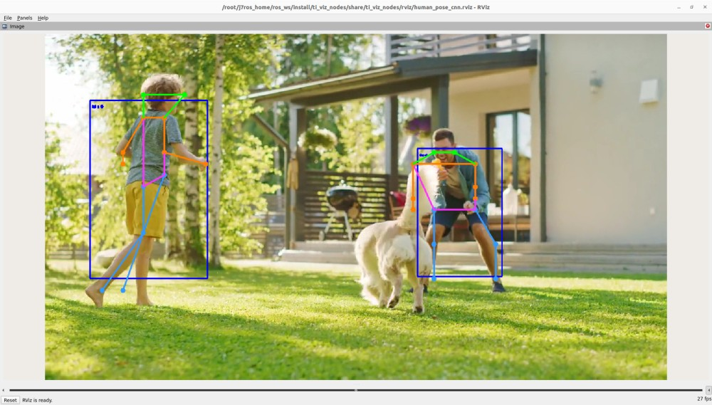

Human Pose Estimation
================


<br />

This `ti_vision_cnn` node is a versatile deep-learning (DL) inference ROS node that is optimized on DL cores and hardware accelerator of TI Processors. The `ti_vision_cnn` node supports compute-intensive DL inference operations, including 2D object detection, 6D Pose Estimation, Human Pose Estimation and semantic segmentation. Figure 1 shows the high-level block diagram of the applications around the `ti_vision_cnn` node, which consists of multiple processing blocks that are deployed on hardware accelerators and DSP processors for pre-processing and post-processing in an optimized manner.

## System Description


<figcaption>Figure 1. Human Pose Estimation demo: block diagram</figcaption>
<br />

For details of block diagram and parameters of `ti_vision_cnn`, please refer to [README.md](./README.md).

For details about the model for Human Pose Estimation, please refer to [YOLO-Keypoint Detection Human Pose Estimation Model](https://github.com/TexasInstruments/edgeai-yolox/blob/main/README_keypoint_detection.md).

```{note}
**cam_id** and **subdev_id** for cameras: You can check the cam_id and subdev_id for the camera
attached to the SK board by running `/opt/edgeai-gst-apps/scripts/setup_cameras.sh`. Accordingly please update the parameters or pass as launch arguments.
```

## Run the Application in ROS 2

**[SK]** To launch the Human Pose Estimation demo with playing back a ROSBAG file, run the following command inside the Docker container on the the target SK board:
```
ros2 launch ti_vision_cnn bag_humanpose_cnn_launch.py
```

To process the image stream from a USB mono camera, depending on choice of resolution, run one from the following commands:
```
ros2 launch ti_vision_cnn gscam_humanpose_cnn_launch.py cam_id:=x
```

**[Visualization on Ubuntu PC]** For setting up environment of the remote PC, please follow [Docker Setup for ROS 2](../../../docker/setting_docker_ros2.md)

Run the following command inside the Docker container on Ubuntu PC:
```
ros2 launch ti_viz_nodes rviz_humanpose_cnn_launch.py
```

## Known Issues

1. The default keypoint detection model outputs a fixed confidence score (around 0.58..) for all the 17 keypoints present in the tensor. The threshold value being 0.5 in our implementation, all the keypoints are overlaid on the given image, as a result, the accuracy of the model may be limited.
