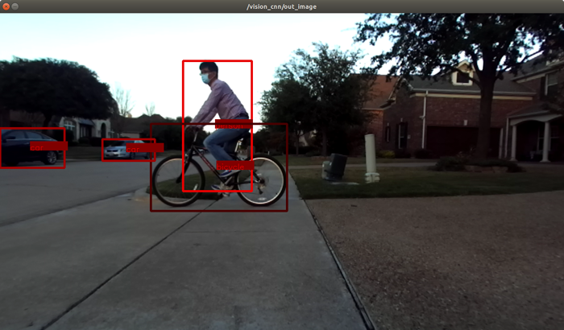

Object Detection
================


<br />

## System Description

This `ti_vision_cnn` node is a versatile deep-learning (DL) inference ROS node that is optimized on DL cores and hardware accelerator of TI Processors. The `ti_vision_cnn` node supports compute-intensive DL inference operations, including 2D object detection and semantic segmentation. Figure 1 shows the high-level block diagram of the applications around the `ti_vision_cnn` node, which consists of multiple processing blocks that are deployed on hardware accelerators and DSP processors for pre-processing and post-processing in an optimized manner.


<figcaption>Figure 1. Object detection demo: block diagram</figcaption>
<br />

For details of block diagram and parameters of `ti_vision_cnn`, please refer to [README.md](./README.md).

```{note}
**cam_id** and **subdev_id** for cameras: You can check the cam_id and subdev_id for the camera
attached to the SK board by running `/opt/edgeai-gst-apps/scripts/setup_cameras.sh`. Accordingly please update the parameters or pass as launch arguments.
```

```{note}
**IMX390 Camera**: Before running, please refer to [gscam2/README_TI.md](../../../ros2/drivers/gscam2/README_TI.md) for generating required LUT files for `tiovxldc`.
```
<!-- ## Run the Application in ROS 1

**[SK]** To launch the object detection demo with playing back a ROSBAG file, run the following command inside the Docker container on the the target SK board:
```
roslaunch ti_vision_cnn bag_objdet_cnn.launch
```

To process the image stream from a ZED stereo camera:
```
roslaunch ti_vision_cnn zed_objdet_cnn.launch video_id:=x zed_sn:=SNxxxxx
```

To process the image stream from a USB mono camera:
```
roslaunch ti_vision_cnn gscam_objdet_cnn.launch video_id:=x
```

For IMX219 camera as input,
```
roslaunch ti_vision_cnn gscam_objdet_cnn_imx219.launch video_id:=x subdev_id=y
```

For IMX390 camera as input, depending on choice of resolution, run one from the following.
```
roslaunch ti_vision_cnn gscam_objdet_cnn_imx390.launch cam_id:=x subdev_id=y width:=1920 height:=1080
roslaunch ti_vision_cnn gscam_objdet_cnn_imx390.launch cam_id:=x subdev_id=y width:=1280 height:=720
roslaunch ti_vision_cnn gscam_objdet_cnn_imx390.launch cam_id:=x subdev_id=y width:=960 height:=540
```

**[Visualization on Ubuntu PC]** For setting up environment of the remote PC, please follow [Docker Setup for ROS 1](../../../docker/setting_docker_ros1.md)

To launch visualization, depending on the resolution setting of the capture node run one from the following:
```
roslaunch ti_viz_nodes rviz_objdet_cnn.launch width:=1920 height:=1080
roslaunch ti_viz_nodes rviz_objdet_cnn.launch width:=1280 height:=720 # default for USB camera and IMX219
roslaunch ti_viz_nodes rviz_objdet_cnn.launch width:=960 height:=540
``` -->

## Run the Application in ROS 2

**[SK]** To launch the object detection demo with a ZED stereo camera, run the following command inside the Docker container on the target:
```
ros2 launch ti_vision_cnn zed_objdet_cnn_launch.py cam_id:=x zed_sn:=SNxxxxx
```

To process the image stream from a USB mono camera:
```
roslaunch ti_vision_cnn gscam_objdet_cnn.launch cam_id:=x
```

For IMX219 camera as input,
```
ros2 launch ti_vision_cnn gscam_objdet_cnn_imx219_launch.py cam_id:=x subdev_id=y
```

For IMX390 camera as input, depending on choice of resolution, run one from the following commands.
```
ros2 launch ti_vision_cnn gscam_objdet_cnn_imx390_launch.py cam_id:=x subdev_id=y width:=1920 height:=1080
ros2 launch ti_vision_cnn gscam_objdet_cnn_imx390_launch.py cam_id:=x subdev_id=y width:=1280 height:=720
ros2 launch ti_vision_cnn gscam_objdet_cnn_imx390_launch.py cam_id:=x subdev_id=y width:=960 height:=540
```

**[Visualization on Ubuntu PC]** For setting up environment of the remote PC, please follow [Docker Setup for ROS 2](../../../docker/setting_docker_ros2.md)

Depending on the resolution setting of the capture node, run one from the following:
```
ros2 launch ti_viz_nodes rviz_objdet_cnn_launch.py width:=1920 height:=1080
ros2 launch ti_viz_nodes rviz_objdet_cnn_launch.py width:=1280 height:=720 $ default for USB camera and IMX219
ros2 launch ti_viz_nodes rviz_objdet_cnn_launch.py width:=960 height:=540
```
